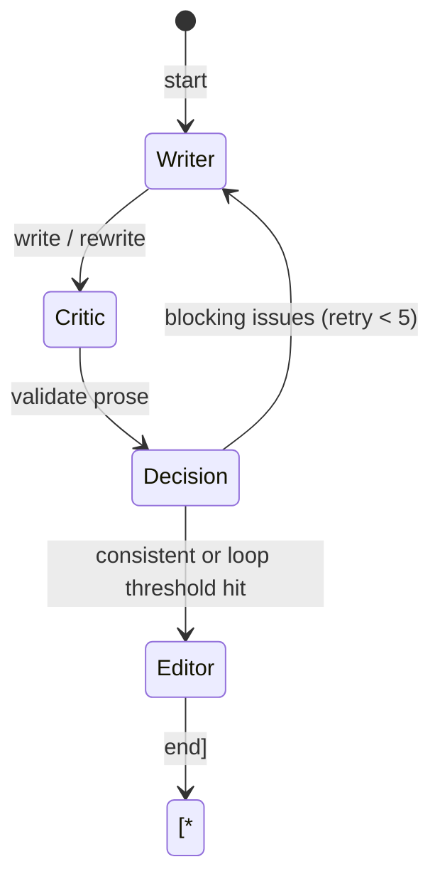

# Story Teller System Architecture & Technical Working Explanation

Welcome to the technical handbook of the **Story Teller** system. This document is designed to give you a deep, exhaustive look into how the backend engine, orchestrator, multi-agent loop, state-management databases, and continuity guardrails work in unison. 

Use this guide to inspect the inner mechanics, trace performance variables, and identify structural or prompt-level enhancements.

---

## 1. High-Level Architecture Overview

Story Teller is designed as a **hierarchical, multi-agent narrative production pipeline**. Rather than asking an LLM to write a 3,000-word chapter in a single pass (which results in generic pacing, repetitive phrasing, and catastrophic memory loss), Story Teller decomposes the creative writing process into distinct planning, draft writing, critique, self-correction, and styling phases.

### Real-Time Data Flow & Orchestration
The system utilizes two primary entry points: a Flask web server (`app.py`) streaming live JSON tokens/events over **Server-Sent Events (SSE)**, and a terminal command line interface (`main.py`) powered by `Rich`. Both interfaces communicate directly with the **Pipeline Orchestrator**.

```mermaid
graph TD
    UI[Flask Web App / CLI] <--> |SSE Events / Commands| PO[Pipeline Orchestrator]
    PO <--> |Read/Write state.json| SM[State Manager]
    PO <--> |Query/Index Chunks| VS[FAISS Vector Store]
    
    PO --> |1. Plan Chapter| Arch[Story Architect Agent]
    PO --> |2. Decompose into Scenes| SP[Scene Planner Agent]
    
    subgraph Scene Loop [3. Progressive Scene Generation Graph]
        Writer[Scene Writer] --> Critic[Consistency Critic]
        Critic --> Dec{Decision Loop}
        Dec -->|Blocking Issues & Iterations < 5| Writer
        Dec -->|Consistent or Stuck| Editor[Style Editor]
    end
    
    PO --> Scene Loop
    Scene Loop --> |Prose Chunks| VS
    Scene Loop --> |Fact Evolution| EE[Evolution Engine]
    EE --> SM
    
    PO --> |4. Assemble & Store| MD[chapter_###.md]
```

---

## 2. Project Files & Directory Layout

Each story project maintains a separate sandbox under `projects/<project_name>/`. The files reflect a split-memory design (structured timeline/character database + semantic prose memory):

```text
projects/<project_name>/
├── state.json                 # Core structured database: character facts, plot history, threads
├── state_history.jsonl        # Append-only transaction log of state updates (for audit/rollback)
├── chapter_###_wip.json       # progressive scene-by-scene drafts (enables seamless crash recovery)
├── chapters/                  # Final output directory
│   └── chapter_001.md         # Full Markdown text of finished chapters
├── logs/                      # Debugging traces
│   ├── chapter_001.json       # Step-by-step orchestrator latency, word count, and model statistics
│   └── chapter_001_trace.jsonl# JSON Line telemetry for every LLM prompt and raw completion
└── vector_index/              # Semantic memory database (FAISS)
    ├── index.faiss            # FAISS index (binary vector records)
    ├── metadata.json          # Text-to-vector mapping metadata
    └── texts.json             # Raw text chunks and source locations (Chapter/Scene/Characters)
```

---

## 3. The Multi-Agent Orchestration Loop

When a user requests the generation of the next chapter (`PipelineOrchestrator.generate_chapter()`), the system triggers a sequential, 7-step assembly line:

```
[0. Pointer Sync] ──> [1. Re-anchoring] ──> [2. Context Retrieval] ──> [3. Architect Planning]
                                                                                │
[7. Progressive Embedding] <── [6. State Evolution] <── [5. Scene Loop] <── [4. Scene Planning]
```

### Step 0: Self-Healing State Pointer Sync
Before generating, the orchestrator scans the filesystem `chapters/` directory. If it finds files (e.g., `chapter_001.md`, `chapter_002.md`) but the internal `state.json` pointer still says `current_chapter: 1` (usually due to a crash or database mismatch), it automatically advances the internal pointer to the actual disk state to prevent regenerating or overwriting text.

### Step 1: Narrative Re-Anchoring
Every `config.REANCHOR_EVERY_N_CHAPTERS` (default: 3) chapters, the **Story Architect** executes a systemic narrative audit (`architect.reanchor()`). It prunes dead traits, compresses character emotional histories, resolves redundant plot hooks, and cleans up the active memory footprint to prevent context window saturation.

### Step 2: Assemble Chapter-Level Planning Context
The **Retriever** (`retriever.py`) builds a comprehensive story prompt context by combining:
1. **The Active Working State**: Character descriptors, traits, current physical and emotional states, active plot threads, and location maps from `state.json`.
2. **Physical Continuity Anchor**: The exact prose of the last 3-4 paragraphs of the preceding chapter (`_previous_chapter_ending`) to guarantee that the narrative tone, characters present, and actions flow seamlessly across chapter borders.
3. **Premise Window Anchor**: Enforces the current slice of the story premise (details in Section 5).
4. **Familiarity Guardrails**: Lists already used chapter titles to ensure title uniqueness.

### Step 3: Chapter Planning (Story Architect)
The **Story Architect** (`agents/architect.py`) accepts the assembled context, the active pacing style (slow, moderate, fast, climactic), and the chapter goal. It outputs a structured JSON plan:
- `chapter_title`
- `plot_direction` (general direction of this chapter)
- `key_events` (list of sequential plot points)
- `character_arcs` (specific goals/progression for each present character)
- `tone` & `constraints`

*Drift Control*: The orchestrator runs an offline validator against the plan. If the plan accidentally references details belonging to future premise steps, a **self-healing repair function** cuts the future references, pulls in missing character introductions, and sanitizes the plan.

### Step 4: Scene Decomposition (Scene Planner)
The **Scene Planner** (`agents/planner.py`) splits the Architect's chapter plan into **2 to 6 scene plans**. Each scene contains:
- `scene_number`, `type` (e.g., dialogue, action, internal monologue)
- `summary` (action description)
- `characters_present`
- `location`
- `word_target` (usually 500–1000 words)
- `narrative_bridge` (explicit reasoning of how this scene hooks into the preceding scene)

### Step 5: Scene Execution Graph (`SCENE_GRAPH`)
Each individual scene is written, evaluated, and edited via an isolated cyclic graph. If a step fails consistency standards, it routes backward to rewrite before moving forward:



#### Node A: Scene Writer (`agents/writer.py`)
- Retrieves semantic memories matching the current scene's characters and location from FAISS.
- Dynamically injects a **Physical Transition Command** if the scene location differs from the previous scene's location.
- Generates prose, streaming tokens back to the UI. If a generation fails, it attempts to fall back to an alternative model (e.g., local model if cloud fails, or vice versa).

#### Node B: Consistency Engine / Critic (`agents/consistency.py`)
- Performs a deep semantic check comparing the generated prose against `state.json` records and FAISS memory context.
- Distinguishes between **Immutable Facts** (e.g. character background, past plot events, location boundaries) and **Mutable States** (e.g. emotional shifts, relationship tension, changing attributes).
- Classifies errors into **Blocking Issues** (factual contradictions, skipping required scene plan beats) and **Non-Blocking Updates** (emotional development, expected personality shifts, injuries).

#### Node C: Decision Node
- If there are **blocking issues**, the engine increments the iteration count (max: 5). It checks if it is stuck in a loop (same issues repeated). If not, it requests a targeted rewrite from the Scene Writer, feeding the critique list back into the writer's prompt.
- If it exceeds 5 rewrites or loops, it logs a warning and proceeds with the best draft to prevent pipeline deadlocks.
- If **only non-blocking updates** exist, it records them to state changes and passes the draft forward.

#### Node D: Style Editor (`agents/editor.py`)
- Cleans up formatting, typos, grammar, and generic phrasing.
- Optimizes sentence length, rhythm, and pacing matching the requested genre.
- Performs a final word-count validation. If the Editor's prose is corrupted or truncated, the orchestrator automatically discards it and falls back to the Writer's best draft.

### Step 6: Narrative State Evolution
Once a scene is finalized, the **Evolution Engine** (`memory/evolution_engine.py`) uses an LLM to read the final prose and extract state developments. It updates `state.json`:
- **Entity Updates**: Extracts new characters, updates character locations.
- **Emotional History**: Calculates new emotional profiles (e.g. fear, desire, confidence) and logs them in the character's `emotional_history` timelines.
- **Relationship Shifts**: Re-evaluates affinity, tension, and dynamics between characters.
- **Events & Timeline**: Records completed timeline events.
- **Importance Scores**: Recalculates character and location relevance weights based on active scene presence.

### Step 7: progressive Saves & Progressive Embedding
- **WIP Checkpoint**: Saves the current scene prose to `chapter_###_wip.json`. If a server crash occurs on scene 3, the orchestrator loads this file, reads the 2 completed scenes, and resumes at scene 3.
- **Semantic Vector Storage**: Splices the scene text into semantic chunks (~400 tokens) and writes them to the FAISS vector index with rich metadata (Chapter, Scene, Characters Present, Location).

---

## 4. Database Schema Structure (`state.json`)

Here is the exact structured state schema maintained by the **State Manager** (`state_manager.py`). The Evolution Engine reads and writes to this structure:

```json
{
  "metadata": {
    "title": "Story Title",
    "genre": "dark fantasy / thriller / romance",
    "premise": "Full multi-line premise text containing all sequential story beats.",
    "themes": ["theme one", "theme two"],
    "setting": "Global world setting overview description.",
    "current_chapter": 3,
    "total_scenes_written": 12,
    "state_version": 45,
    "narrative_phase": "rising_action / climax / falling_action / resolution",
    "created_at": "ISO-TIMESTAMP",
    "updated_at": "ISO-TIMESTAMP"
  },
  "characters": {
    "character_name": {
      "description": "Physical details, age, role.",
      "traits": ["Loyal", "Stubborn", "Traumatized"],
      "relationships": {
        "other_character": "Description of active relationship dynamics."
      },
      "state": {
        "emotion": "vengeful",
        "location": "castle_dungeons",
        "goal": "Retrieve the keys."
      },
      "arc_progression": [
        "Chronological history notes on character development."
      ],
      "role": "main / supporting / background",
      "emotional_history": [
        {
          "chapter": 1,
          "emotion": "fear",
          "cause": "Attack on the village.",
          "intensity": 0.8
        }
      ],
      "importance_score": 0.85,
      "mention_count": 142,
      "dialogue_density": 0.08,
      "status": "active / dead / missing"
    }
  },
  "world": {
    "locations": {
      "location_name": {
        "description": "Sensory cues, layout details.",
        "connected_to": ["other_location"]
      }
    },
    "rules": ["World rules: e.g. Magic requires blood sacrifice."],
    "timeline": ["Significant global event summaries in chronological order."]
  },
  "plot": {
    "major_events": [
      {
        "event": "Description of what happened.",
        "chapter": 1,
        "timestamp": "ISO-TIMESTAMP"
      }
    ],
    "unresolved_threads": [
      "Subplots that have been opened but not yet closed."
    ],
    "foreshadowing": [
      "Clues dropped in earlier chapters."
    ],
    "chapter_summaries": [
      {
        "chapter": 1,
        "summary": "Full overview of chapter events."
      }
    ]
  },
  "transitions": [
    {
      "from_chapter": 1,
      "from_scene": 2,
      "to_scene": 3,
      "time_elapsed": "4 hours later",
      "physical_states": {
        "character_name": "exhausted"
      },
      "open_conversations": [],
      "environmental_carryover": ["heavy rain"],
      "emotional_carryover": ["tension"]
    }
  ]
}
```

---

## 5. Continuity & Drift Prevention Guardrails

Long-form fiction generators suffer heavily from **drift** (forgetting core themes, ignoring character deaths, jumping prematurely to the climax, repeating the same scene setup in multiple chapters). Story Teller utilizes several specialized algorithms to lock down the narrative structure:

### A. Premise Order Cursor & Narrative Anchoring
Rather than dumping the entire premise into the LLM context (which causes the model to jump ahead), the system implements an active **sliding window** with hard constraints:
1. **Step Splitter**: The orchestrator splits the multi-line premise into a clean sequential list of distinct narrative steps (`_premise_steps`).
2. **Cursor Windowing**: Every chapter is allocated a strict window of allowed steps. Future steps are injected as Hard Negative constraints.
3. **Narrative Position Anchor**: The **Story Architect** is forced to read a positional anchor before planning (e.g., *"You are at premise step 4 of 18. Narrative phase: RISING_ACTION. Intensity: 0.4/1.0. Do not resolve conflicts. Advance only."*).
4. **Architect Self-Check**: Before returning a chapter plan, the Architect runs a self-validation pass. It checks that every `key_event` maps to an allowed step, no future characters are introduced prematurely, and chapter titles aren't duplicated. If it fails, it auto-reprompts with the specific violations.

### B. Evolution Engine Strict Guardrails
Extracting state updates after every scene is a major vector for hallucinated trait changes or premature relationship resolutions.
- **Inference Ban**: The **Evolution Engine** is explicitly forbidden from inferring emotional shifts, inventing events, or marking relationships as resolved unless explicitly stated in dialogue or action within the prose.
- **Pending Review Buffer**: Any low-confidence or unverified extraction is flagged with `pending_review: true`. These uncertain updates are quarantined into a `pending_updates` buffer and are not immediately committed to `state.json`, stopping cascading hallucinations.

### C. Hybrid Recency-Weighted Semantic Retrieval
Relying solely on semantic similarity (`FAISS`) can pull in stale emotional contexts (e.g., retrieving a hostile scene from Chapter 2 when characters are now lovers in Chapter 7).
- **Recency Decay**: The Retriever applies a recency formula: `recency_score = 1.0 - 0.05 * (current_chapter - chunk_chapter)`.
- **Hybrid Combination**: Final ranking is `semantic_score * 0.7 + recency_score * 0.3`. Recent chapters almost always outweigh older ones unless the query explicitly requests backstory. Secondary tie-breakers (+0.05 max) prioritize character overlap, unresolved plot threads, and emotional resonance.

### D. Multi-Pass Consistency Validation
The **Consistency Engine** (`agents/consistency.py`) runs two distinct validation passes on every generated scene:
1. **Internal Consistency Pass**: Validates factual logic against the structured `state.json` (location errors, timeline, character identity).
2. **Premise Alignment Pass**: Validates the scene against the active premise window. It evaluates: *Does this scene serve an allowed step? Has a forbidden future step leaked in? Is the emotional intensity appropriate for the narrative phase?* Any leakage of forbidden future beats triggers a blocking `premise_alignment` error, forcing the Writer to rewrite the scene.

### E. Transition & Anti-Mirror Prose Anchors
Abrupt scene transitions and repetitive pacing are disorienting.
- **Physical Transition Anchors**: If Scene $N$ takes place in a new location, the writer prompt is injected with a strict instruction to show the characters physically traveling or deciding to move.
- **Anti-Mirror Constraint**: The **Scene Writer** receives the exact *closing paragraph* of the preceding scene with a strict constraint: *"Your opening must not repeat the sentence structure, mood, or descriptive framing of this closing paragraph."* Furthermore, if the prior scene ended on internal reflection, the system forces the new scene to open with concrete action or dialogue.
- **N-Gram Repetition Filter**: The orchestrator runs an **8-gram overlap check** on consecutive scene boundaries, executing a prefix-clipping algorithm if looping prose is detected.

---

## 6. Web App REST API & Event Streaming

The web application (`app.py`) serves as the orchestration control plane. Communication with the user interface is managed via highly optimized routes:

### Real-Time SSE Event Streaming
Standard REST endpoints block until a process is finished. For chapter generations that take 1-3 minutes, Story Teller uses SSE routes:
- **Endpoint**: `/api/project/<name>/generate/stream`
- **Mechanism**: Spawns a background thread running `generate_chapter`. It pushes structured SSE JSON frames onto a shared thread-safe queue. The streaming endpoint yields events:
  - `chapter_start`: Initializing generation parameters.
  - `agent_active`: Swapping UI highlights (e.g. highlighting "Story Architect", "Consistency Engine").
  - `token`: High-frequency streaming chunks for live prose rendering.
  - `scene_complete` / `chapter_complete`: Emitting finished stats (words, latency).
  - `error` / `cancelled`: Handles abrupt cancellations gracefully without locking file descriptors.

### Interactive Manual Page Flow
For users who want precise control, the system exposes an interactive manual generator:
1. **Creation**: Spawns an in-memory session `/api/project/<name>/generate/manual`.
2. **Enhancement**: The user types a short brief (e.g., *"Rosna gets an anonymous text during lecture"*). The orchestrator runs this through the `MANUAL_SCENE_ENHANCER_SYSTEM` to add sensory cues, physical setups, and formatting, without advancing the story beyond the brief.
3. **Progressive Control**: The user generates the scene, reads it, and can manually delete the scene, edit the prompt, or regenerate it before clicking "Finish Chapter" to compile, update `state.json`, and write vector chunks.

---

## 7. The Gemini Combine & Polish Pipeline

While the multi-agent Orchestrator excels at writing detailed, progressive scenes (Chapter by Chapter), it inherently works locally and piece-by-piece. For full-book finalization, the system utilizes the **Gemini Combine & Polish Pipeline** (`pipeline/gemini_combiner.py`).

Because Google's Gemini models possess a massive context window (1M–2M+ tokens), Story Teller can send the **entire book draft** and the **original premise blueprint** to Gemini in a single API call for holistic developmental editing.

### The Pipeline Flow:
1. **Deduplication**: The system first concatenates all generated markdown chapters and runs a paragraph-level deduplication algorithm (`_dedup_paragraphs`) to strip out looping text or redundant scene boundaries before sending.
2. **Context Injection**: The `MASTER STORY PREMISE` is injected at the top of the prompt. Gemini is instructed to use this as its absolute blueprint.
3. **The Gemini Pass (Two-Fold Mission)**:
   - **Holistic Polish**: Gemini analyzes the entire text, resolving tense drift, fixing character name swaps, smoothing over abrupt physical transitions, and fixing pacing across chapter boundaries.
   - **Premise Completion**: If the local orchestrator only generated 5 chapters but the premise describes a 10-chapter arc, Gemini is instructed to **write the missing premise beats from scratch**. It fills in narrative gaps, extending the story into a fully-realized, complete novel rather than just summarizing the ending.
4. **Post-Processing & Output**: Gemini returns a structured response containing an `---ANALYSIS---` (a report on what it fixed and which missing beats it added) and the `---REVISED_STORY---`. 
5. **Resequencing**: The system runs a Regex-based re-sequencer (`_resequence_chapter_headers`) on the final text to guarantee that chapter headers are strictly numbered 1, 2, 3... correcting any hallucinations where the LLM might have duplicated chapter numbers.

---

## 8. Strategic Enhancement Ideas (For Your Review)

Now that you understand the entire flow, here are several high-impact architecture, prompt, and algorithmic areas where we could implement improvements. **Which of these areas would you like to explore first?**

### Area 1: Deep Memory & Subplot Tracking
- *Current Limit*: Active memory retrieval is purely semantic (FAISS searches prose chunks). Highly abstract relations, background secrets, or complex subplots can get lost in the context window.
- *Potential Fix*: Add a **"Subplot & Secrets Tracker"** to the `state.json` schema. The Evolution Engine would track open subplots, their states (latent, active, climax, resolved), and which character knows which secret, explicitly feeding this structure to the Architect and Writer prompts.

### Area 2: Adaptive Tone & Genre Prompt Routing
- *Current Limit*: System prompts for the Writer and Architect are generic.
- *Potential Fix*: Implement **Genre Prompt Routing**. Based on the `metadata.genre` in `state.json` (e.g., erotica, dark fantasy, cozy mystery), the system can select specialized system instructions:
  - Cozy Mystery: Focuses on subtle physical clues, pacing, red herrings.
  - Dark Fantasy: Emphasizes gritty environment descriptors, high-stakes combat, visceral physical descriptions.
  - Erotica: Focuses heavily on sensory arousal, emotional/physical tension, and explicit details.

### Area 3: Fine-Grained Consistency Scoring
- *Current Limit*: The Consistency Engine validation relies on a binary `is_consistent` plus list critique. A single minor, subjective style check can sometimes trigger a heavy rewrite cycle.
- *Potential Fix*: Transition validation to a **Weighted Consistency Index (WCI)**. Issues are scored on severity (Critical: character identity mismatch, dead character revived; Mild: character mood shift). Mild issues are auto-resolved by injecting editing instructions, whereas only Critical issues trigger a full Writer rewrite.

### Area 4: Vector Store & Retrieval Improvements
- *Current Limit*: Vector chunks are divided by static token size (400 tokens). This can split critical sentences or dialogue exchanges in half.
- *Potential Fix*: Switch to **Semantic Bracket/Dialogue Boundary Chunking**. Chunking boundaries will split exclusively on paragraph breaks or scene splits, ensuring complete semantic context is preserved when retrieved.

---

### What would you like to do next?
1. **Review active files** (e.g., view specialized prompts inside `agents/writer.py` or `agents/architect.py`).
2. **Dive into any specific Area** from the Enhancement suggestions above.
3. **Make direct prompt tweaks** to optimize current generation outputs.
